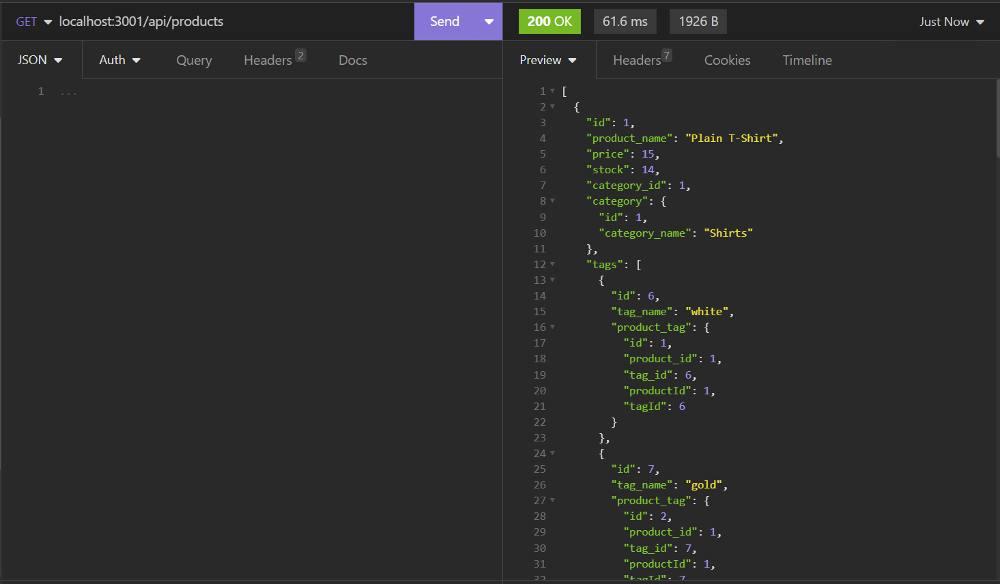
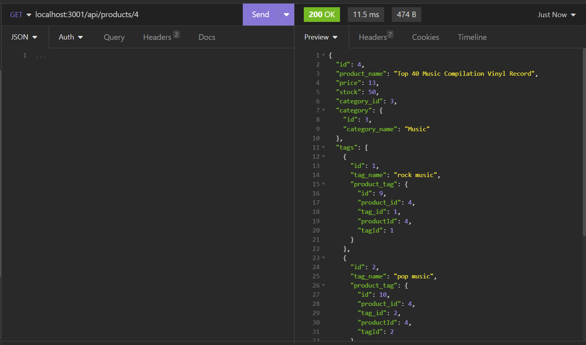
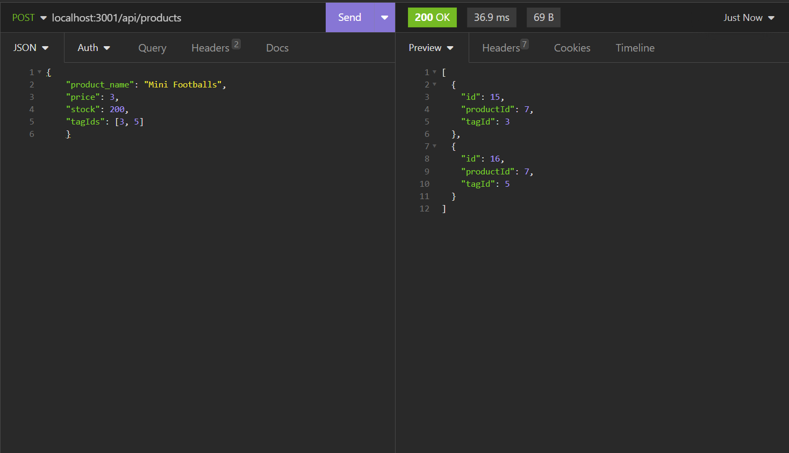
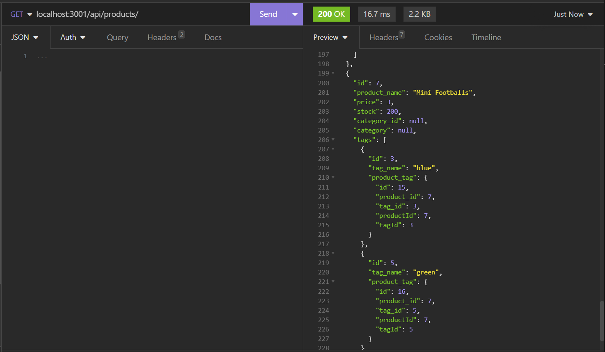
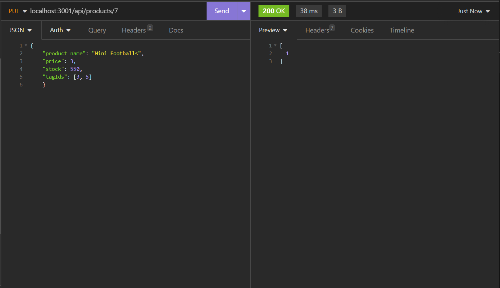
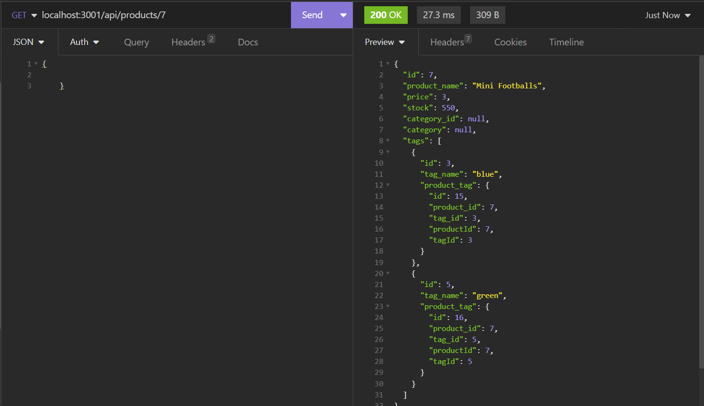
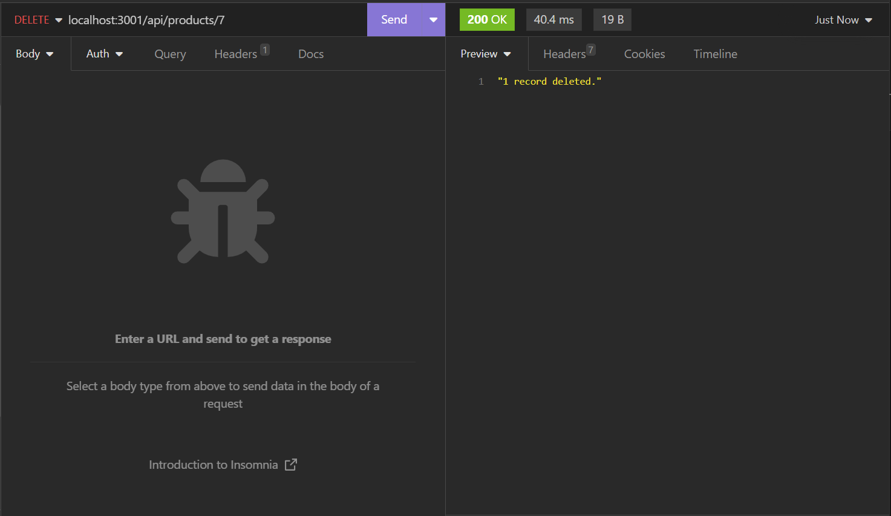
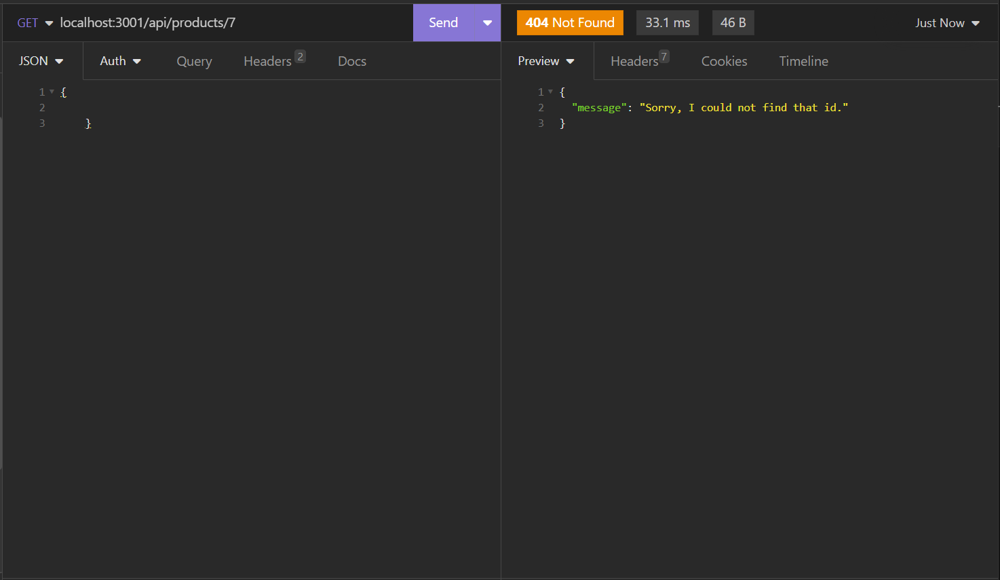
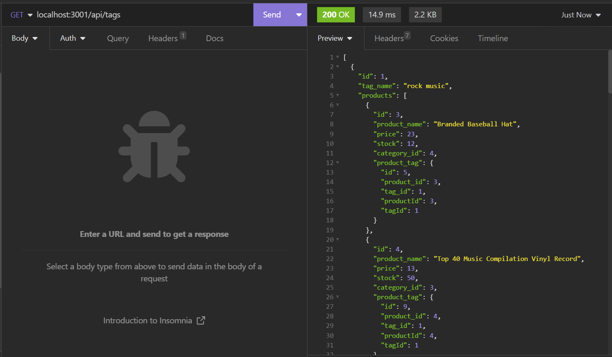
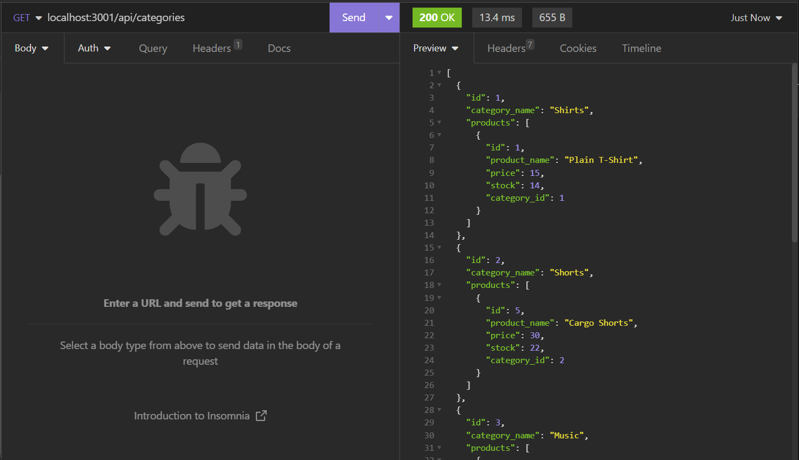

# ORM-e-commerce-backend
This is Rick's ORM e-commerce backend project.

## Description
The purpose of this project is to build a back end for an e-commerce site by modifying starter code. This will be done by configuring a working Express.js API to use Sequelize to interact with a MySQL databse. This project will utilize Node.js, Express.js, Sequelize, and MySQL. Acceptance Criteria have been broken down into individual features (e.g. AC01). For details on the implementation, review the applicable 'Usage' section of this README.

### User Story

* AS A manager at an internet retail company
I WANT a back end for my e-commerce website that uses the latest technologies
SO THAT my company can compete with other e-commerce companies

### Acceptance Criteria

>* GIVEN a functional Express.js API

>* AC01: Connect to Database / Establish Environment Variable Security
>    -	WHEN I add my database name, MySQL username, and MySQL password to an environment variable file 
>    -	THEN I am able to connect to a database using Sequelize

>* AC02: Source Schema and Seed Database
>    -	WHEN I enter schema and seed commands
>    -	THEN a development database is created and is seeded with test data

>* AC03: Start Server and Sync to Database
>    -	WHEN I enter the command to invoke the application
>    -	THEN my server is started and the Sequelize models are synced to the MySQL database

>* AC04: GET Queries
>    -	WHEN I open API GET routes in Insomnia for categories, products, and tags
>    -	THEN the data for each of these routes is displayed in a formatted JSON

>* AC05: POST, PUT, DELETE Queries 
>    -	WHEN I test API POST, PUT, and DELETE routes in Insomnia
>    -	THEN I am able to successfully create, update, and delete data in my database

## Database Models

>* Category 
>    -	id
>       - INTEGER
>       - NOT NULL
>       - PRIMARY KEY
>       - AUTO INCREMENT
>    -	category_name
>       - INTEGER
>       - NOT NULL
>       - PRIMARY KEY
>       - AUTO INCREMENT

>* Product 
>    -	id
>       - INTEGER
>       - NOT NULL
>       - PRIMARY KEY
>       - AUTO INCREMENT
>    -	product_name
>       - STRING
>       - NOT NULL
>    -	price
>       - DECIMEL
>       - NOT NULL
>    -	stock
>       - INTEGER
>       - NOT NULL
>       - DEFAULT VALUE: 10
>    -	category_id
>       - INTEGER
>       - REFERENCES Category (id)

>* Tag 
>    -	id
>       - INTEGER
>       - NOT NULL
>       - PRIMARY KEY
>       - AUTO INCREMENT
>    -	tag_name
>       - STRING

>* ProductTag 
>    -	id
>       - INTEGER
>       - NOT NULL
>       - PRIMARY KEY
>       - AUTO INCREMENT
>    -	product_id
>       - INTEGER
>       - REFERENCES Product (id)
>    -	tag_id
>       - INTEGER
>       - REFERENCES Tag (id)

>* ASSOCIATIONS: 
>    -	Product belongs to Category
>    -  Category has many Products

## Installation

> * To watch a video showing the application in use, open the browser and paste the following URL in the address bar, or click on the link: https://watch.screencastify.com/v/Z75WtiOfHKQ2brfCD1Z8
> * To access the project repo, open the browser and paste the following URL in the address bar, or click on the link: https://github.com/recenasu/ORM-e-commerce-backend

## Usage

> * From VSCode, open a terminal window
> * Navigate to the project root directory using bash
> * Login into MySQL
> * Type: "source ./db/schema.sql" and Press Enter to run the database schema
> * Type: "use ecommerce_db;" and Press Enter (AC01)
> * Click the trash can icon to exit this terminal window
> * Open a new terminal window and navigate to the project root directory using bash
> * Type: "npm run seed" and confirm that the database is seeded with sample data (AC02)
> * Click the trash can icon to exit this terminal window
> * Open a new terminal window and navigate to the project root directory using bash
> * Type: "npm start" and confirm that the connection to the database is established first, then the server is started and is listening (AC03)
> * Open Insomnia
> * Perform GET queries on the following APIs: (AC04)
>   - categories
>   - categories/:id
>   - products
>   - products/:id
>   - tags
>   - tags/:id
> * Perform POST, PUT, and DELETE queries on the following APIs: (AC05)
>   - categories
>   - products
>   - tags

A few sample images of the application API routes interacting with Insomnia test queries are provided below. To view a video demo of the full functionality, go to this link: https://watch.screencastify.com/v/Z75WtiOfHKQ2brfCD1Z8

> * *GET all products*

> * *GET a single product by id*

> * *POST a new product*

> * *GET all products to view newly added product*

> * *PUT update a product by id*

> * *GET the updated product by id to confirm change ("stock:" to 550)*

> * *DELETE a product by id*

> * *GET deleted product by id to confirm deletion by viewing expected error message*

> * *GET all tags*

> * *GET all categories*

## Credits

> * npm sequelize v5.21.7 module was used for Node.js interaction with the MySQL database.
> * npm dotenv v8.2.0 module was used for environment variable security.
> * npm express v4.17.1 module was used for creating API routes.
> * npm mysql12 v2.1.0 module was used for connecting to the database.

